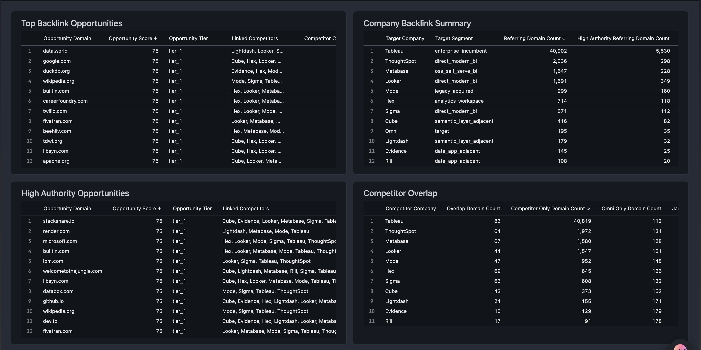
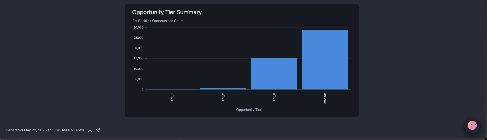
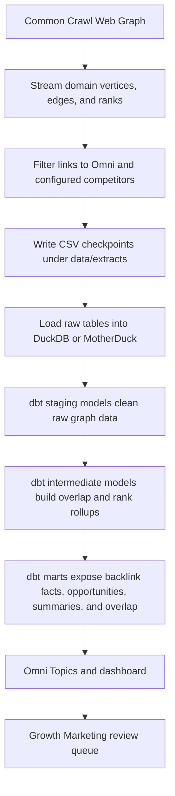

# Crawlback

Crawlback is a Common Crawl backlink intelligence pipeline for Omni's Growth Marketing team. It identifies domains that link to Omni's analytics and BI competitors, do not appear to link to Omni, and should be reviewed as backlink outreach opportunities.

Live dashboard: [Omni Growth Intelligence](https://dparagiri.embed-omniapp.co/dashboards/35441517)

## Executive Summary

The analysis focuses on one Growth Marketing question: which domains already mention analytics and BI competitors, are missing Omni, and are worth Growth Marketing investigation?

The current run uses Common Crawl Web Graph release `cc-main-2026-feb-mar-apr`, from crawl snapshot `CC-MAIN-2026-17`. The domain graph contains `124,646,710` domain nodes and `4,756,191,406` domain-to-domain edges. The extractor streamed the graph, filtered it to Omni and configured competitors, and kept `49,603` relevant backlink edges from `45,023` distinct referring domains.

The modeled output contains `44,828` opportunity domains. Every opportunity links to at least one competitor and does not link to Omni in this Common Crawl snapshot. `5,853` opportunities are high authority by the project definition, meaning the referring domain is in Common Crawl's `top_10k` or `top_100k` rank bucket. The strictest top tier has `37` domains: high-authority domains that link to several competitors and score highest under the transparent heuristic.

Omni's observed backlink footprint is smaller than the direct modern-BI peer set. In this snapshot, referring-domain count ranks as Tableau, ThoughtSpot, Metabase, Looker, Mode, Hex, Sigma, Cube, Omni, Lightdash, Evidence, and Rill. Tableau is expected to dominate because it is a large incumbent, so it is useful for audience discovery but not as a direct peer benchmark. Omni has `195` referring domains in the graph, with `35` high-authority referring domains.

The most actionable overlap signal is with adjacent modern-BI and semantic-layer companies. Hex, Sigma, Cube, and Lightdash have the highest Jaccard overlap with Omni, which means their backlink base resembles Omni's current backlink base more than the larger incumbents do. The largest unclaimed pools are Tableau, ThoughtSpot, Metabase, and Looker, which means they have the broadest competitor-only domain pools for Omni to inspect.

The top-ranked opportunity domains include broad developer, data, startup, and software ecosystems such as `github.com`, `dev.to`, `ycombinator.com`, `github.io`, `blogspot.com`, `tdwi.org`, `builtin.com`, `fivetran.com`, and `stackshare.io`. These should not be treated as automatic outreach targets. They are the first review queue because they combine authority, competitor co-linking, and category-adjacent signal.

## Business Context

Growth Marketing needs a prioritized review queue, not a raw backlink dump. Crawlback starts from domains that already link to analytics and BI competitors such as Tableau, Looker, Sigma, Hex, Metabase, and ThoughtSpot, then removes domains that also link to Omni in the same Common Crawl snapshot.

The strongest signal is competitor co-linking. A domain that links to several companies in Omni's category has already shown category interest. If Omni is absent, that domain becomes a plausible coverage gap for marketing review, comparison-page outreach, partner ecosystem analysis, or content strategy.

The dashboard turns this into an investigation workflow: ranked opportunities first, then company backlink footprint, competitor overlap, and opportunity-tier distribution for context.

## Dashboard Preview





## Questions Covered

| Business question | Modeled answer |
|---|---|
| How many referring domains does Omni have vs each competitor? | `analytics.mart_company_backlink_summary` |
| What is the backlink strength of each company? | `analytics.mart_company_backlink_summary.backlink_strength_proxy` |
| Which high-authority domains link to competitors but not Omni? | `analytics.fct_backlink_opportunities` filtered to `source_high_authority_flag = true` |
| Which competitors have the most backlink overlap with Omni? | `analytics.mart_competitor_overlap` |
| What are the top backlink opportunities Omni should investigate? | `analytics.fct_backlink_opportunities` sorted by `opportunity_score` |

## Key Results

### Company Backlink Summary

| Company | Segment | Referring domains | High-authority referring domains | Strength proxy |
|---|---|---:|---:|---:|
| Tableau | enterprise incumbent | 40,902 | 5,530 | 100.00 |
| ThoughtSpot | direct modern BI | 2,036 | 298 | 5.12 |
| Metabase | OSS self-serve BI | 1,647 | 228 | 4.06 |
| Looker | direct modern BI | 1,591 | 349 | 4.74 |
| Mode | legacy or acquired | 999 | 160 | 2.60 |
| Hex | analytics workspace | 714 | 118 | 1.88 |
| Sigma | direct modern BI | 671 | 112 | 1.78 |
| Cube | semantic-layer adjacent | 416 | 82 | 1.18 |
| Omni | target | 195 | 35 | 0.53 |
| Lightdash | semantic-layer adjacent | 179 | 32 | 0.49 |
| Evidence | data-app adjacent | 145 | 25 | 0.39 |
| Rill | data-app adjacent | 108 | 20 | 0.30 |

The absolute strength proxy is compressed by Tableau's scale. The useful comparison for Omni is the relative gap against direct and adjacent peers, not Tableau alone.

### Competitor Overlap

| Competitor | Shared with Omni | Competitor-only domains | Jaccard overlap |
|---|---:|---:|---:|
| Hex | 69 | 645 | 0.0821 |
| Sigma | 63 | 608 | 0.0785 |
| Cube | 43 | 373 | 0.0757 |
| Lightdash | 24 | 155 | 0.0686 |
| Rill | 17 | 91 | 0.0594 |
| Evidence | 16 | 129 | 0.0494 |
| Mode | 47 | 952 | 0.0410 |
| Metabase | 67 | 1,580 | 0.0377 |
| ThoughtSpot | 64 | 1,972 | 0.0295 |
| Looker | 44 | 1,547 | 0.0253 |
| Tableau | 83 | 40,819 | 0.0020 |

Overlap and competitor-only count answer different Growth questions. High overlap means the competitor's audience looks closer to Omni's existing audience. High competitor-only count means a larger unclaimed pool.

### Opportunity Distribution

| Metric | Value |
|---|---:|
| Opportunity domains | 44,828 |
| High-authority opportunities | 5,853 |
| Tier 1 opportunities | 37 |
| Tier 2 opportunities | 797 |
| Tier 3 opportunities | 15,379 |
| Monitor opportunities | 28,615 |
| Maximum competitors linked by one opportunity domain | 11 |

Opportunity score ranges from `15.0` to `75.0` in v1. The theoretical maximum is 100, but WAT-derived category relevance and evidence-quality components are zero because page-level WAT enrichment is not populated.

## Data Flow



## Methodology

### Web Graph As Primary Source

Common Crawl does not provide a reverse-link page index. There is no cheap endpoint for "show every page that links to omni.co." The practical choices are either scanning page-level crawl artifacts broadly, which is too large for this scope, or using Common Crawl's Web Graph, which is already aggregated into link relationships.

The Web Graph is the right primitive for the core questions because it directly answers which domains link to which other domains. It is strong for coverage, overlap, and opportunity discovery. It does not provide page titles, anchor text, or exact source URLs.

### Domain Grain

The analysis uses the Common Crawl domain graph, not the host graph. Growth outreach usually happens at the organization or domain level, not at individual subdomains. Domain grain also prevents subdomain-heavy sites from inflating the comparison.

The rank signal comes from Common Crawl domain ranks. A high-authority domain is one in the `top_10k` or `top_100k` rank bucket.

### Competitor Segmentation

The competitor list is segmented rather than treated as a flat peer set.

| Segment | Companies | Reason |
|---|---|---|
| Target | Omni | Subject of analysis |
| Direct modern BI | Sigma, Looker, ThoughtSpot | Closest commercial peer set |
| Analytics workspace | Hex | Adjacent analytical workflow |
| Semantic-layer adjacent | Lightdash, Cube | Closest to Omni's semantic-layer positioning |
| OSS and data-app adjacent | Metabase, Evidence, Rill | Related markets with different go-to-market motion |
| Enterprise incumbent | Tableau | Category-scale incumbent used for audience discovery |
| Legacy or acquired | Mode | Useful signal but backlinks may include historical acquisition artifacts |

Power BI is excluded from v1. Its backlink footprint is spread across `powerbi.microsoft.com`, `app.powerbi.com`, `learn.microsoft.com/power-bi/*`, and broader Microsoft properties. Modeling it cleanly requires path-level rules, which do not fit a domain-graph-only v1.

### Opportunity Scoring

The project does not use paid SEO metrics, so opportunity value is expressed as a transparent Common Crawl heuristic.

```text
opportunity_score =
    30 * competitor_coverage_signal
  + 25 * authority_signal
  + 15 * segment_relevance_signal
  + 15 * category_relevance_signal
  + 10 * evidence_quality_signal
  +  5 * clean_domain_signal
```

Each component is normalized to `[0, 1]`, and the weights sum to 100. Competitor coverage rewards domains that link to multiple competitors but not Omni. Authority uses Common Crawl rank buckets. Segment relevance rewards links to closer Omni peer groups. Category relevance and evidence quality are WAT-dependent and evaluate to zero in v1. Clean-domain signal is a light penalty against obviously low-quality domain patterns.

Competitor co-linking is the main signal because it identifies domains already participating in the analytics and BI conversation. If a domain links to several Omni competitors and not Omni, that absence is a plausible coverage gap. These domains are better starting points than arbitrary high-authority domains because they have already shown category interest.

### Transformation Ownership

Scoring, joins, and business definitions live in dbt so they are version-controlled and tested. Omni exposes the modeled tables as business-readable Topics and dashboard tiles.

## Reproducing The Work

### Prerequisites

| Requirement | Purpose |
|---|---|
| Python 3.12 or newer | Runtime |
| `uv` | Dependency and command runner |
| MotherDuck token | Required only for cloud load and Omni |
| Omni instance | Required only for semantic layer and dashboard |

### Setup

```bash
uv sync --locked
cp .env.example .env
```

For MotherDuck, edit `.env` and set `MOTHERDUCK_TOKEN`. `MOTHERDUCK_DATABASE` defaults to `crawlback`.

### Run Locally With DuckDB

```bash
uv run python scripts/extract_graph.py
uv run python scripts/load_graph.py
uv run dbt build --project-dir dbt --profiles-dir dbt
```

This creates `data/crawlback.duckdb` and builds the `analytics` schema locally.

### Run Against MotherDuck

```bash
uv run python scripts/extract_graph.py
uv run --env-file .env python scripts/load_graph.py --database motherduck
uv run --env-file .env dbt build --project-dir dbt --profiles-dir dbt --target motherduck
```

The MotherDuck flow loads the same raw graph artifacts and builds the same dbt marts in the cloud database that Omni queries. If `data/extracts/cc-main-2026-feb-mar-apr/` already exists from a local run, the MotherDuck flow can start at `load_graph.py`.

### Verify

These checks work from a fresh clone and do not require Common Crawl data:

```bash
uv run ruff check .
uv run ruff format --check .
uv run mypy src tests scripts
uv run pytest
uv run dbt parse --project-dir dbt --profiles-dir dbt
```

After `extract_graph.py` and `load_graph.py` have populated the raw tables, verify the modeled tables with:

```bash
uv run dbt build --project-dir dbt --profiles-dir dbt
uv run --env-file .env dbt build --project-dir dbt --profiles-dir dbt --target motherduck
```

Current verification status is green: clean-clone `uv sync --locked` succeeds, `ruff` passes, formatting passes, `mypy` passes, `pytest` reports `46 passed`, dbt parse succeeds, local dbt build reports `PASS=85 WARN=0 ERROR=0`, and MotherDuck dbt build reports `PASS=85 WARN=0 ERROR=0`.

### Expected Row Counts

| Object | Rows |
|---|---:|
| `raw.raw_common_crawl_domain_edges` | 49,603 |
| `raw.raw_common_crawl_domain_ranks` | 45,023 |
| `raw.raw_common_crawl_wat_link_evidence` | 0 |
| `analytics.fct_backlinks` | 49,603 |
| `analytics.fct_backlink_opportunities` | 44,828 |
| `analytics.mart_company_backlink_summary` | 12 |
| `analytics.mart_competitor_overlap` | 11 |

## Model Contract

The dbt marts are the analytical contract.

| Model | Purpose |
|---|---|
| `dim_companies` | Company, domain, role, and segment metadata |
| `fct_backlinks` | Clean source-domain to target-company backlink facts |
| `fct_backlink_opportunities` | Ranked domains linking to competitors but not Omni |
| `mart_company_backlink_summary` | Company-level footprint and strength comparison |
| `mart_competitor_overlap` | Overlap and competitor-only domain pools vs Omni |

The dbt tests enforce that opportunity rows do not link to Omni, opportunity domains are unique per graph release, scores are between 0 and 100, competitor counts are positive, and company references are valid.

The Omni semantic-layer files live under `omni/`. They define one top-level `model`, one `relationships` file, one `.view` file per modeled table, and three Topics: `Backlink Opportunities`, `Company Backlink Summary`, and `Competitor Overlap`.

## Code Map

| Path | Purpose |
|---|---|
| `configs/` | Competitor list, segments, graph release configuration |
| `scripts/extract_graph.py` | Streams and filters the Common Crawl Web Graph into local checkpoints |
| `scripts/load_graph.py` | Loads checkpoints into DuckDB or MotherDuck raw tables |
| `src/crawlback/` | Python package for Common Crawl access, normalization, validation, extraction, and loading |
| `dbt/` | Sources, staging models, intermediate models, marts, seeds, and dbt tests |
| `omni/` | Versioned Omni semantic-layer files |
| `assets/` | Dashboard screenshots used in this README |
| `tests/` | Python unit tests |

## Limitations

Common Crawl is incomplete and snapshot-based. It may miss pages, include stale pages, omit JavaScript-rendered links, and exclude pages outside the selected crawl window.

The Web Graph is domain-level. This is the right grain for Growth outreach and competitor coverage, but it cannot show exact source URLs, page titles, anchor text, or the referring-page context.

The authority proxy is not an SEO vendor metric. It is based on Common Crawl rank buckets and is useful for relative comparison inside this analysis. It should not be interpreted as Ahrefs Domain Rating, Moz Domain Authority, Semrush Authority Score, organic traffic, or Google ranking strength.

The opportunity score is a heuristic. It prioritizes investigation based on graph structure and rank signals. It does not predict outreach success or guaranteed SEO value.

WAT enrichment is not populated in v1. This means `category_relevance_signal` and `evidence_quality_signal` are zero, and the dashboard cannot show example URLs or anchor text yet. The schema and dbt path are in place so page-level evidence can be added later without changing the mart contract.

Power BI is excluded because a domain-level graph cannot cleanly model its Microsoft-hosted footprint. A correct Power BI implementation needs path-level rules across Microsoft marketing, app, and documentation surfaces.

The competitor list is curated rather than exhaustive. It is config-driven and can be extended, but different competitor choices would change the opportunity ranking.

## Future Work

The highest-value next step is bounded WAT enrichment for the top opportunity domains. That would add example URLs, page titles, link context, category relevance, and stronger recommended actions.

Power BI should be added only after the pipeline supports path-level matching. Treating all Microsoft-owned domains as Power BI backlinks would be misleading.

The dashboard should support manual review status, such as `new`, `in review`, `rejected`, `outreach started`, and `claimed`. That would turn the discovery artifact into an operational Growth workflow.

Running this per Common Crawl release would create a backlink trend table. That would show whether Omni's footprint is growing relative to competitors and whether specific opportunities have been claimed.

Additional quality signals could improve prioritization. Examples include spam classification, domain category labels, manual blocklists, SEO vendor metrics, and content-type classification once page-level evidence exists.
